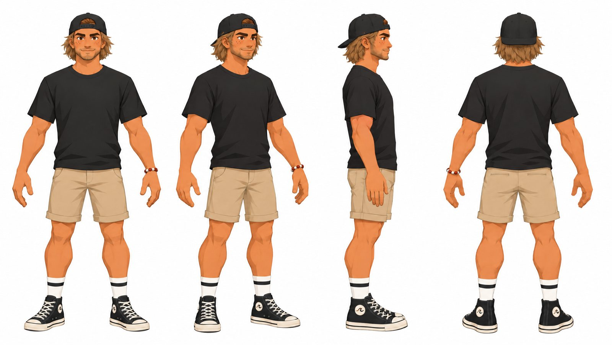
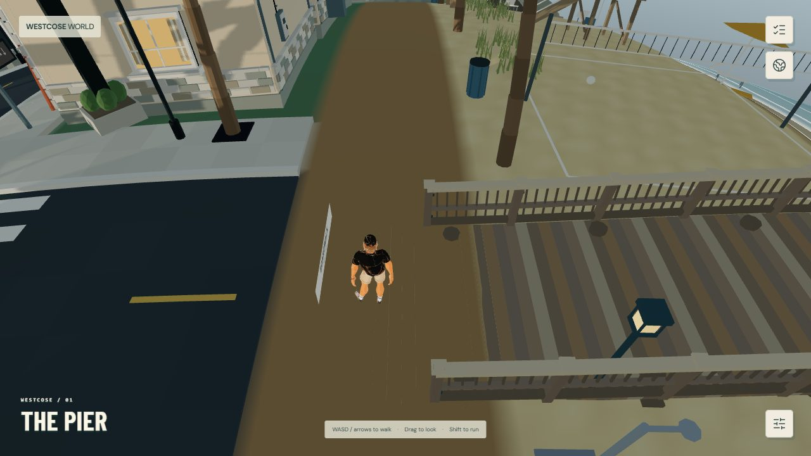
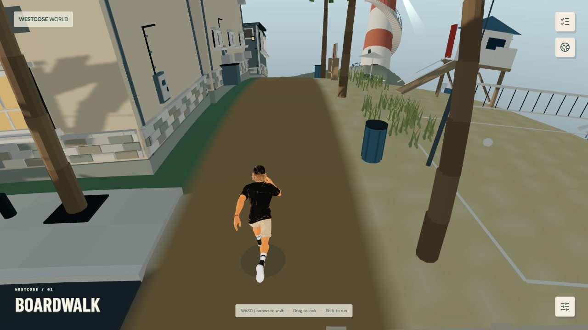
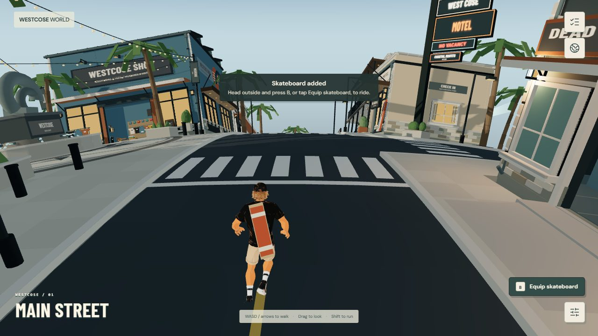
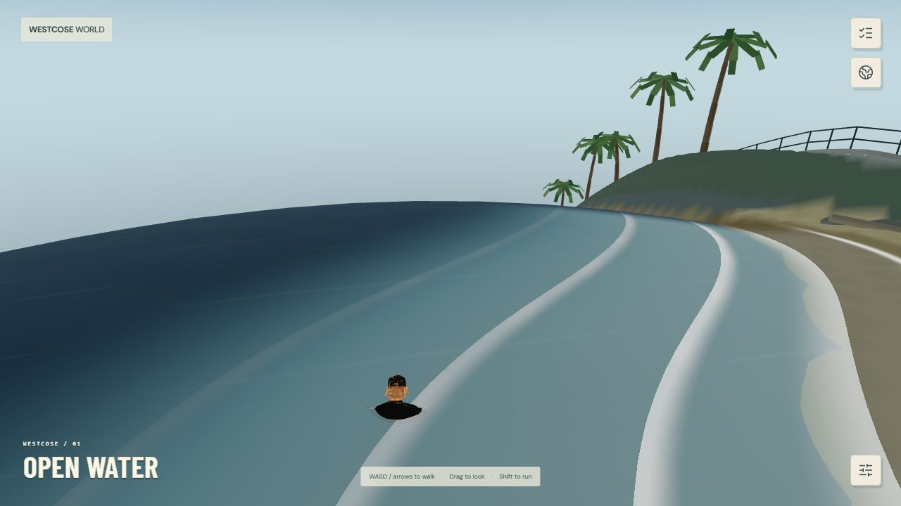

# The Local: polished walker character (V1)

The box-built walker is replaced by **the Local**, a textured, rigged toon character. He has a backwards black cap, sandy brown hair, a plain black tee, rolled khaki shorts, striped socks and black canvas high-tops. Each ankle patch carries a cream WestCose wave. He idles, jogs, sprints, swims and treads water. Once a board is owned, it rides strapped across his back.

V1 covers the walker only. The snowboard rider, skater and angler are still procedural.



| Idle | Sprint | Board on back | Treading water |
|---|---|---|---|
|  |  |  |  |

## How it was made

The model was generated through the Higgsfield MCP. Every credit spend was quoted with `get_cost` first and approved; the total was 86.25 credits.

1. **Design.** The user drew front and back references. `gpt_image_2_5` turned them into an approved four-view sheet (job `e081f037…`). Two changes were made at this stage: the Converse star became a WestCose wave because of the trademark, and the backpack was dropped.
2. **3D.** `multi_image_to_3d` (Meshy) took the four views and produced a textured, rigged model with 12.5k triangles, standing 1.85 m (job `b8e4c052…`).
3. **Clips.** `3d_rigging` re-rigged that model once per clip:

   | Clip | Meshy action |
   |---|---|
   | Idle | `Idle_6` (246) |
   | Jog | `Run_02` (14) |
   | Run | `RunFast` (16) |
   | Swim | `Swim_Forward` (569) |
   | Tread | `Swim_Idle` (568) |

   The idle that came with the 3D job (clip 0) was a wide fighter's stance, so it isn't used.
4. **Local post-processing** (`pipeline/`, Python with numpy and Pillow):
   - **`repaint_shoe_patch.py`**: the generated texture brought the star back on the ankle patches. This script maps texels back onto the shoe in 3D, finds the four patch discs from the geometry, and repaints each one. Each disc gets a cream fill, an inked wave, and a canvas-black rim over the old disc's edge. UV seams don't matter because the work is done in 3D.
   - **`retarget_pack.py`**: each rigging job binds the mesh with slightly different joint orientations (up to about 25 cm of bind-matrix drift at the hands), so clips can't be copied between rigs as-is. Per bone, the script reapplies each source's world-space motion, measured relative to its own bind pose, onto the base rig's bind pose. It then packs one GLB: the base mesh and skin, all five clips, and the repainted texture at 1024 px. Tangents, scale tracks and constant translation tracks are dropped.
   - To rebuild:
     ```
     python pipeline/repaint_shoe_patch.py jog-rig.glb base.glb
     python pipeline/retarget_pack.py visitor.glb 1024 base.glb:Jog idle6.glb:Idle runfast.glb:Run swim.glb:Swim swimidle.glb:Tread
     ```

The result is `public/world/models/visitor.glb`: 1.40 MB, one skinned mesh, one draw call, 12,468 triangles. The box walker it replaces took about 25 draw calls.

## Runtime

| File | Role |
|---|---|
| `src/features/world/player/visitor-model.ts` | Loads the GLB with `GLTFLoader` and swaps its material for `MeshToonMaterial`, keeping the texture. Owns the `AnimationMixer` and blends the five clips. |
| `src/features/world/player/PlayerController.tsx` | Mounts the model inside the `visitor` group. Hides the box walker once the model loads, and keeps it if loading fails. Feeds the model a smoothed ground speed and moves the board onto the `Spine02` bone. |
| `scripts/check-visitor-model.mjs` | `npm run test:visitor`. Checks the size and triangle budgets, the single mesh and skin, that all five clips drive every joint, and the 1.85 m height with feet at the origin. |

- **Blend.** On land the weights are Idle → Jog (speed 0.15–2.4 m/s) → Run (5.4–7.6 m/s). In water they are Tread → Swim (0.2–1.8 m/s). The land/water switch eases in over about 0.3 s.
- **Playback speed.** Jog plays at speed / 4.5 m/s and Run at speed / 8 m/s; the jog figure was measured from its foot plants. At the 4.8 m/s walk the feet stay planted.
- **Water depth.** The feet origin sits 1.32 m below the surface while treading, which puts the shoulders at the waterline. While swimming it sits 0.42 m below, so the body lies along the surface. The two depths blend with the clips. The box walker's fake bob and limb swing apply only to the fallback.
- **Facing and visibility.** glTF faces +Z and the walker group faces −Z, so the model is turned 180°. The first-person cutaway below 1.6 m of camera distance still hides the whole group.
- **Reduced motion.** The clips keep playing; the idle sway runs at half speed.
- **Fallback.** While the GLB downloads, or if it fails, the original box walker is shown, and a warning is logged with `[visitor]`.

## Validation

- `npm run test:visitor`, typecheck and lint pass.
- All Playwright suites pass with the model in place (26 tests): `world`, `sea-cave`, `skate` and `fishing`.
- In-game review shots cover idle, jog, sprint, swim, tread and the back-strapped board (`reference/`).

## Out of scope for V1

- The snowboard rider, skater and angler still use their procedural figures.
- There are no turn-in-place, jump, fall or landing clips. Airborne frames keep the locomotion blend.
- The board strap is a simple dark band, not modelled webbing.
- Clothing-shop outfits don't change the Local's texture yet.
