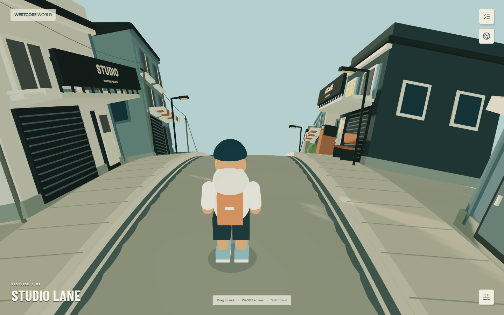
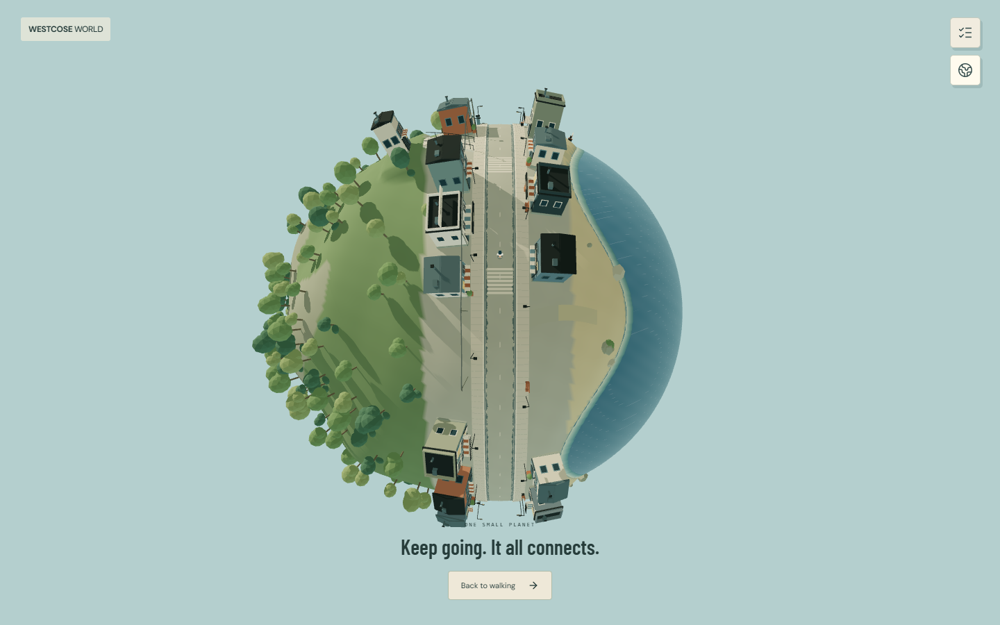

# Planet V2 validation — September 5, 2026

This is the archived Planet V2 baseline. See [Dead Coast QA](../dead-coast/README.md) for the current expansion. The parent QA directory preserves the earlier flat prototype for comparison.

| Check | Result |
| --- | --- |
| ESLint | Passed |
| TypeScript | Passed, including production compilation |
| Deterministic planet suite | 10 passed |
| Browser suite | 13 passed in 2.3 minutes |
| Final camera / pole / mouse / touch regression checks | 4 passed |
| Production build | Passed; all application routes prerendered |
| Production route audit | Passed |
| Visual review | 12 current desktop / phone captures, plus camera comparison captures |

## Functional evidence

The browser suite holds normal Shift + W input until the visitor completes a full equatorial circuit, then checks return position, radius and tangent heading. It also crosses the north pole, walks up the authored steps, pushes against a studio wall, moves beyond the coast into water, and verifies camera obstruction.

Other browser checks cover mouse drag/release, compact nearby conversations, field-note discovery, HTML project navigation and return, pause/reset, reduced effects, invalid saved data, the unconnected FightClub cabinet, unavailable WebGL and touch movement.

The deterministic suite runs the actual terrain/controller modules. It verifies complete circuits, both poles, consistent polar terrain height, all twelve steps, sidewalk rise, collision and sliding, camera rays, water support and malformed/blocked storage. It uses a temporary compiled directory that is safely removed afterward.

The four affected browser checks were rerun after the final close-camera and pole-height changes. No page errors occurred in these runs or the production audit.

## Production measurements

Fresh Chrome contexts against the local production server:

| Route | Measured transfer | World chunks | Canvas | External requests |
| --- | ---: | ---: | ---: | ---: |
| /projects | 266,548 bytes | 0 | 0 | 0 |
| /services | 266,019 bytes | 0 | 0 | 0 |
| /world | 512,628 bytes | 1 | 1 | 0 |

The development diagnostic/fixture API is absent in production. See [raw production results](production-check.json). Transfer includes the document, scripts and local fonts; hosting and cache settings can change it.

The final entry view reports 57 render calls, 264,058 rendered triangles, 39 geometries and 11 textures. See [render counters](render-counters.json).

Environment: Windows, Node 24, installed Google Chrome in headless mode, software WebGL permitted. Phone testing uses a 390×844 touch viewport and browser-level touch events. These checks do not establish physical phone performance or sustained hardware FPS.

## Final browser views

[Globe entry](01-globe-entry.png) · [Studio Lane](02-studio-lane.png) · [Overlook steps](03-overlook-steps.png) · [Narrow alley](04-alley.png) · [Coast](05-coast.png) · [Discovery note](06-discovery-note.png) · [Ocean](07-ocean.png) · [Field notes](08-field-notes.png) · [Planet view](09-planet-view.png) · [Phone globe](10-phone-globe.png) · [Phone walking](11-phone-walking.png) · [Phone notes](12-phone-notes.png)

## Current limits

Scenery and the avatar are an original procedural art pass. Decorative trees, lamps, benches and small props are not individually collidable. Water uses slower travel and a lowered avatar, without a dedicated swim animation. There are no NPC quests, authored interiors or audio system. FightClub has no supplied build/URL, and real contact/service/project content is still pending.

The original planning documents are preserved. [Planet V2 architecture](../../PLANET_V2.md) records the user's direction change and the shared surface design.
